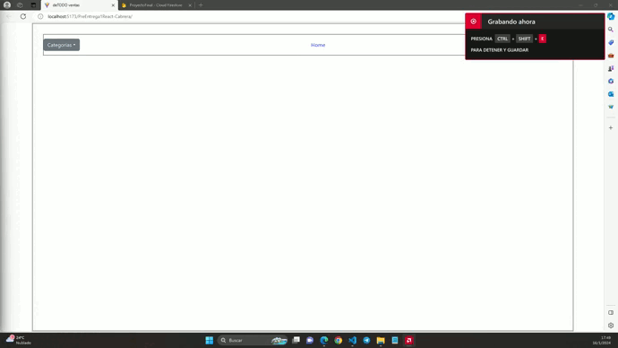

# React + Vite
## Proyecto de React de My Ecommerce
### Alumno: Cabrera Cristian

|My|Ecommerce|
|--|--| 

[Perfil de Linkedin](https://www.linkedin.com/in/cabreracristiandv/)

En este proyecto final realice un Ecommerce, donde se pueden ver los articulos disponibles mediante el boton Home y tambien ver las distintas categorias, seleccionando cualquiera de las cuatro o tambien el catalogo completo, que funciona igual que Home. 

Una vez clickeado alguna de estas opciones se presentan todos los productos y en estos se puede interactuar viendolos en detalle mediante el boton o tambien enviarlos al carrito. En el carrito, conectado mediante Context pueden sumarse todos los productos que se desee, sumandose los que sean iguales y tambien calculandose los precios totales.

Las rutas estan enlazadas con react-router-dom.

Los productos estan todos en firebase, que se conecta directamente con la app para su consulta, tambien en el carrito se puede crear una coleccion en firebase donde se agregan los datos del comprador y tambien los productos seleccionados para la compra.

Visualmente la app es pobre, pero esta hecha con chakra-ui.

